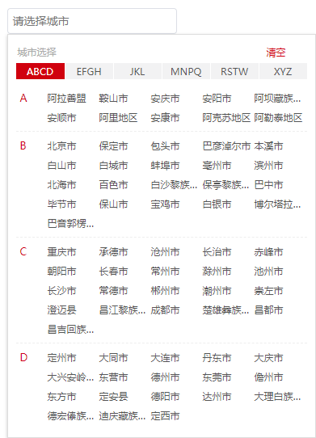

# city-selector

city-selector是一款基于vue2+的全国城市筛选器

## 截图




## 安装

#### npm

```shell
$ npm install vue2-city-selector
```
## 使用

```html
<city-selector field="city" placeholder="请选择城市" :city-list="cityListArr" v-model="cityId"></city-selector>
```

```js
// 全局使用
import Vue from 'vue';
import citySelector from 'vue2-city-selector'
Vue.use(citySelector)

// 局部引用
import {citySelector} from "vue2-city-selector";
export default {
    components: {
        citySelector
    },
    data() {
        return {
            cityId: '',
            cityListArr: {
                'hot': [
                    {id: 410500, name: "安阳市"}
                ],
                A: [
                    {id: 152900, name: "阿拉善盟"},
                    {id: 210300, name: "鞍山市"},
                    {id: 340800, name: "安庆市"},
                    {id: 410500, name: "安阳市"},
                    {id: 513200, name: "阿坝藏族羌族自治州"},
                    {id: 520400, name: "安顺市"},
                    {id: 542500, name: "阿里地区"},
                    {id: 610900, name: "安康市"},
                    {id: 652900, name: "阿克苏地区"},
                    {id: 654300, name: "阿勒泰地区"}
                ]
            }
        }
    }
}

```

#### 相关参数

| 名称              | 类型               | 默认             | 说明                                          |
| ----------------- | ----------------- | ---------------- | --------------------------------------------- |
| v-model           | String            | ""               | 要双向绑定的城市Id                              |
| field             | String            | ""               | 会给input标签添加name及id属性                   |
| placeholder       | String            | ""               | 提示信息                                       |
| no-hot            | Boolean           | false            | 没有‘热门城市’                                  |
| city-list         | Object            | []               | 可以自定义城市列表
